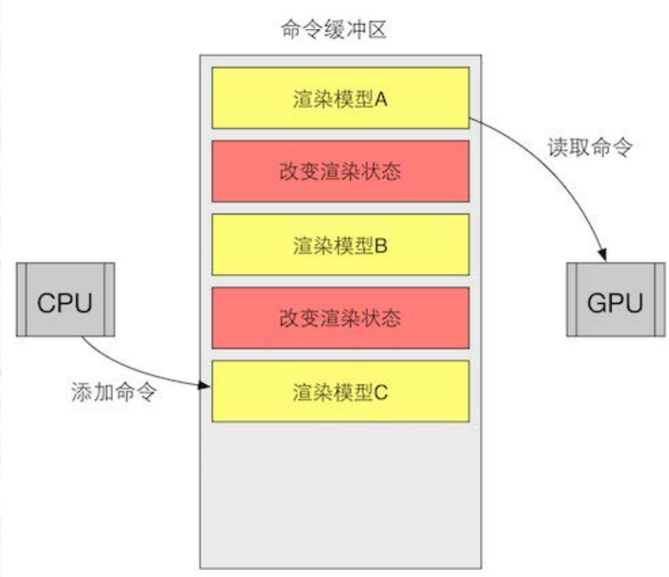
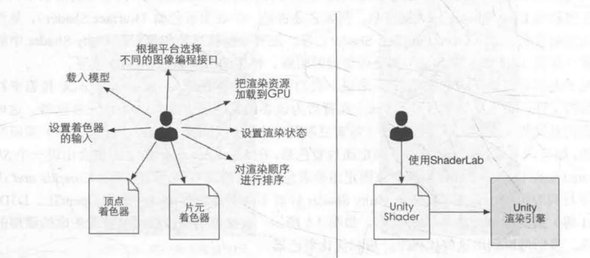
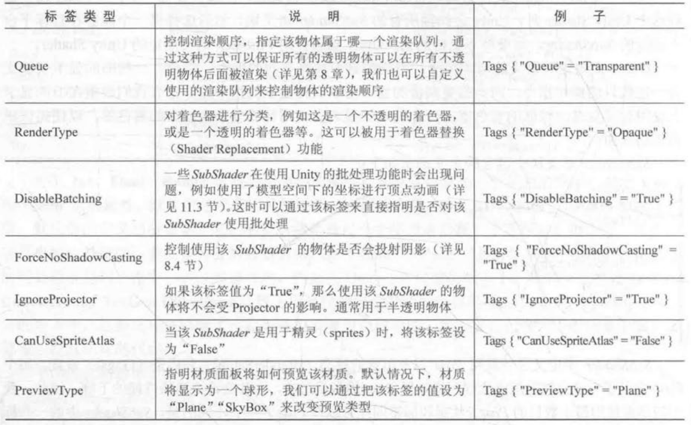

# Unity Shader入门精要

## 第二章 渲染流水线

### 2.4 一些容易困惑的地方

#### 2.4.3 关于Draw Call
1. CPU与GPU进行并行工作
渲染管线是以流水线的方式并行运行的，其中需要CPU与GPU进行并行工作，由CPU提供模型、数据给GPU，并调用Draw CAll命令，由GPU进行计算渲染。而为了能实现两者并行工作，需要一个**命令缓冲区(Command Buffer)**。
命令缓冲区包含了一个命令队列，由CPU添加命令，GPU读取命令。命令包括Draw Call、改变渲染状态等。

2. 为什么Draw Call多了影响帧率？
每次调用Draw Call之前，CPU需要向GPU发送很多内容，包括数据、状态、命令等。CPU完成准备阶段，GPU开始绘制，其渲染能力很强，渲染200个或者2000个没什么区别，因此往往会快于CPU提交命令的速度。如果Draw Call数量太多，CPU将会把大量时间花费在提交Draw Call上，造成CPU过载，GPU已经渲染结束，而CPU还没有准备好下一个渲染命令，导致GPU空闲
3. 如何减少Draw Call
方法很多，这里仅讨论使用**批处理(Batching)**。
将很多小的DrawCall合并成一个大的Draw Call。
由于需要在CPU中合并网格，其合并过程需要时间，所以批处理技术更适合于静态的物体，只需要合并一次。对动态物体也可以进行合并，需要每一帧都重新进行合并，对空间时间会造成一定影响。
游戏开发中，为了减少Draw Call的开销，有两点需要注意：
（1）避免使用大量过小的网格。需要使用很小的网格时，可以考虑合并它们。
（2）避免使用过多的材质

阅读材料：
[关于批处理的内容](https://www.nvidia.com/docs/IO/8228/BatchBatchBatch.pdf)

## 第三章 Unity Shader基础
### 3.1 Unity Shader概述
#### 3.1.3 Unity中的Shader
Unity提供了4中Unity Shader模板：
| Unity Shader| 模板内容|
| :---: | :---: |
| Standard Surface Shader   | 包含了标准光照模型（PBR）的表面着色器模板 |
| Unlit Shader              | 不包含光照（但包含雾效）的基本顶点/片元着色器 |
| Image Effect Shader       | 实现各种屏幕后处理效果的基本模板 |
| Compute Shader            | 利用GPU并行性进行与渲染流水线无关的计算（不在本书范围）|

### 3.2 Unity Shader基础：ShaderLab
Unity给开发者提供了更高层的渲染抽象层，即Unity Shader。若没有Unity Shader，开发者需要和很多文件和设置打交道（顶点/片元着色器，设置着色器输入，载入模型、根据平台选择图像编程接口，设置渲染状态、对渲染顺序排序等等），而在Unity Shader的帮助下，开发者只需要ShaderLab来编写UnityShader就可以完成所有工作。

ShaderLab是Unity提供的编写Unity Shader的一种说明性语言。它使用了一些嵌套在花括号内部的**语义(syntax)**来描述一个Unity Shader文件的结构。
一个Unity Shader的基础结构如下：
```ShaderLab
Shader "ShaderName" {
    Properties {
        //属性
    }
    SubShader {
        //显卡A使用的子着色器
    }
    SubShader {
        //显卡B使用的子着色器
    }
    Fallback "VertexLit"
}
```

### 3.3 Shader结构
1. Properties
即使不在Properties语义块中声明这些属性，也可以直接在CG代码片中定义变量，然后通过脚本向Shader中传递这些属性。因此，Properties语义块的作用仅仅是为了让这些属性可以出现在材质面板中。
2. SubShader
SubShader语义块中包含的定义通常如下：
```ShaderLab
SubShader {
    //可选的
    [tags]

    //可选的
    [RenderSetup]

    Pass {

    }
    // Other Passes
}
```
每个Pass定义了一次完整的渲染流程，Pass的数目过多，往往会造成渲染性能的下降。状态和标签同样可以在Pass声明。不同的是，SubShader中的一些标签设置是特定的，与Pass不同，而状态设置的语法是相同的。在SubShader中进行的设置，将会用于所有的Pass。
+ 状态设置（RenderSetup）
| 状态名称 | 设置指令 | 解释 |
| :---: | :---: | :---: |
| Cull | Cull Back/Front/Off | 设置剔除模式 |
| ZTest | ZTest Less Greater/LEqual/GEqual/Equal/NotEqual/Always | 设置深度测试时使用的函数 |
| ZWrite | ZWrite On/Off | 开启/关闭深度写入 |
| Blend | Blend srcFactor DstFactor | 开启并设置混合模式 |
+ 标签
SubShader的标签是一个键值对，键和值都是字符串类型。是SubShader和渲染引擎之间的沟通桥梁。标签结构如下：
```ShaderLab
Tags {  "TagName1" = "Value1" "TagName2" = "Valuew2" }
```

3. Pass语义包
```ShaderLab
Pass {
    [Name]
    [Tags]
    [RenderSetup]
    //Other code
}
```
关于名称：
```ShaderLab
//定义一个Pass的名称
Name "MyPassName"
//通过名称，使用其他的Shader中的Pass
UsePass "MyShader/MYPASSNAME"  // 注意需要全部转为大写形式
```
Pass的标签不同于SubShader的标签，但也是用来告诉渲染引擎怎么进行渲染的。
4. GrabPass
该Pass负责抓取屏幕并将结果存储在一张纹理中，用于后续的Pass处理

### 3.4 Unity Shader的形式

#### 3.4.1 表面着色器
表面着色器需要的代码量很少，Unity在背后做了很多工作，但渲染的代价比较大。它在本质上和下面要讲的顶点/片元着色器是一样的。即，Unity仍会把表面着色器转换成对应的顶点/片元着色器。它存在的价值是，**Unity为我们处理了很多光照细节**。
代码：
```ShaderLab
Shader "Custom/Simple VertexFragment Shader" {
    SubShader {
        Tags { "RendereType" = "Opaque" }
        CGPROGRAM
        #pragma surface surf Lambert
        struct Input {
            float4 color : COLOR;
        };
        void surf (Input IN, inout SurfaceOutput o)
        {
            o.Albedo = 1;
        }
        ENDCG
    }
    Fallback "Diffuse"
}
```
表面着色器被定义在 SubShader 语义块（而非 Pass 语义块）中的CGPROGRAM 和 ENDCG 之间 。原因是，表而着色器不需要开发者关心使用多少个 Pass、每个Pass 如何渲染等问题，Unity会在背后为我们做好这些事情。我们要做的只是告诉它 ：“ 嘿，使用这些纹理去填充颜色，使用这个法线纹理去填充法线，使用 Lambert 光照模型，其他的不要来烦我！”。

#### 3.4.2 顶点/片元着色器
顶点/片元着色器的代码也需要定义在 CGPROGRAM 和 ENDCG 之间，但不同的是，顶点/片元着色器是写在Pass语义块内，而非SubShader内的。原因是，我们需要自已定义每个Pass需要使用的Shader代码 。

#### 3.4.4 选择哪种Unity Shader
+ 如果想和各种光源打交道，可能更喜欢使用表面着色器，但需要小心它在移动平台的性能表现
+ 如果你需要使用的光照数目非常少，例如只有一个平行光，那么使用顶点/片元着色器更好
+ 更重要的是，如果有很多自定义的渲染效果，请选择顶点/片元着色器


### 3.6 答疑解惑
#### 3.6.1 Unity Shader != 真正的Shader
Unity Shader实际上就是一个ShaderLab文件——硬盘中以`.shader`作为文件后缀的一种文件。在Unity Shader里，我们能做的远多于传统的shader。
+ 可以在Unity Shader中同时包含需要的顶点着色器和片元着色器
+ 通过一行指令即可开启混合、深度测试等渲染设置，这些在传统Shader中无法执行
+ 传统Shader需要编写冗长代码来设置着色器的输入输出。而Unity Shader只需要在特定语句块中声明一些属性，就可以依靠材质来方便的改变属性。

也有缺点：
由于封装，可以编写的Shader类型和语法被限制，例如曲面细分Shader、几何Shader等，支持就差一些。

扩展阅读：
[Unity官方文档](http://docs.unity3d.com/Manual/SL-Reference.html)