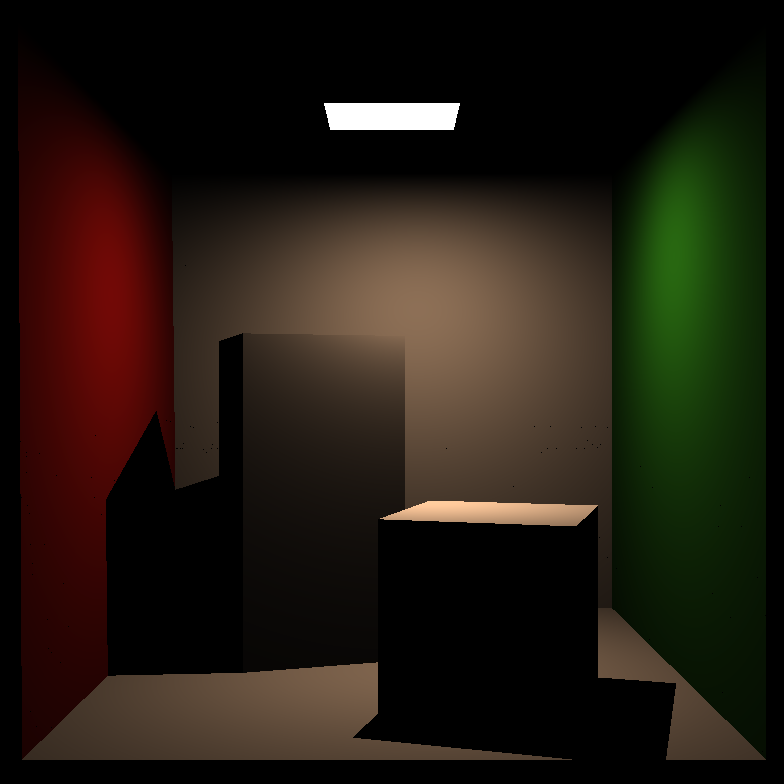
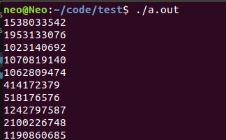

先来看生成随机数的代码:
```C++
#include<random>
//随机生成均匀分布在0-1的实数
float RNG()
{
    std::random_device dev;
    std::mt19937 rng(dev());
    std::uniform_real_distribution<float> dist(0.f,1.f);

    return dist(rng);
}
```

这几行代码对于和我一样的新手初见来说可能很疑惑，为什么不能用rand()来生成呢
##### 为什么不可以用rand()
rand()函数生成的是伪随机数，将种子作为参数（通常是时间），进行一系列的大数取余操作，得到一个伪随机的数字
且由于时间参数是很容易捕捉的，因此这并不是一个优秀的方法

### 蒙特卡洛方法中需要什么样的随机数

有关的蒙特卡洛相关知识可到另一个帖子查看（挖坑）
> 【光线追踪】蒙特卡洛方法用于光追的理论基础

简单概括，蒙特卡洛方法中当按照所需采样数据的概率密度进行采样时，所得到的结果的偏差才会是0，而对于每种概率密度，将其进行积分之后在y轴的0-1范围内进行均匀采样，再通过逆函数得到的值才是符合要求的采样结果
所以我们需要完成在0-1范围的实数均匀采样

如果采样数据不依照分布或者随机性进行采样，计算渲染方程时计算的是错的，那么渲染出来的结果也自然是错误的，比如下面是我在做GAMES101时做光追踩的坑：

这是spp为16时的直接光照渲染结果，而这个结果显然是错误的，光线追踪的特征之一软阴影完全没有体现，且GAMES101的采样策略是半球均匀采样，少量的采样必然会造成很大的噪点，而图片却几乎没有噪点，阴影也被渲染成硬阴影。问题就出现在不随机了，每次光源采样都采样到同一个点上，面光源被迫成为了点光源，自然就只有硬阴影了。（关于采样的相关知识可到`【光线追踪】光源采样、重要性采样、多重重要性采样`了解~（挖坑）~）
我的程序为什么没有给出随机数呢，这和`random_device()`有关


1. random_device

random_device是真随机数生成器，原理是利用熵池，熵池可以理解为由操作系统来维护的一个存储空间，类似于在运行过程中按一定规则进行补充（具体实现我也不清楚），而我们每次调用一次，从熵池中取出一个数，这样就可以得到高质量的随机数。

而只有Linux才有熵池，Windows则是用rand_s()来实现的，显然不能满足要求，渲染出来的结果也自然错误。
下面对于同一段代码：
```C++
#include<iostream>
#include<random>

int main()
{
    std::random_device dev;
    for(int i=0; i<10; ++i)
        std::cout << dev() << std::endl;
    return 0;
}
```
Windows下g++编译的运行结果：

已经完全不是随机数了！
Linux下g++编译的运行结果：


+ Windows下不能用random_device吗
其实是可以的，这个是在Visual Studio的MSVC编译下的运行结果：

所以在MSVC中可以正常运行

+ 可以只使用random_device生成随机数吗
不好，熵池里的数字是有限的，多次调用不仅损耗系统性能，且用完了之后会发生错误
因此，通用做法是用random_device生成真随机数作为种子传给random number engine(mt19937)，再由随机数引擎生成一系列伪随机数

2. mt19937

号称是最好的伪随机数生成器，名称的由来则是它所基于的`Mersenne Twister`算法，产生的随机数的周期长可达到$2^19937-1$

C++11引入的新特性中，除了伪随机数引擎，还有与其配套的分布，用于控制生成随机数的分布、类型和范围

3. uniform_real_distribution\<float> dist(0.f, 1.f)

这行代码即是在0-1上进行浮点数的均匀采样，精度为float，也可设置为double

+ uniform_int_distribution  均匀分布地采样整数
+ normal_distribution 常态分布
+ exponential_distribution 指数分布
+ poisson_distribution 泊松分布